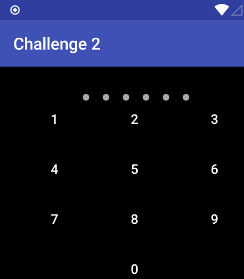

## Challenge 2

I started the second challenge immediately after finishing that last writeup, and managed to get it completed relatively quickly, although in a very hacky way which I'm not sure is the best. In any case, I have gotten the flag and learned a lot about about smali, so that is great. I also had to get Android 7 running on my device because otherwise the challenge APK would not install, a big shoutout to Samsung for deprecating my device even though it's perfectly good.

### Backround

The second challenge also consists of a simple APK file. I installed it on my test device by downloading the APK and then running `adb install -r challenge2_release.apk`. You should have ADB installed from the last chapter. The challenge looks like this:

 

I thought I'd `apktool` decode same as I explained on the previous section, and I tried to dive right in to the smali code. At first I noticed that there were a few embedded libraries, like libsodium. Libsodium is a cryptography library and in my opinion it is relatively secure. Thinking ahead, this means two things: the challenge will involve cryptography, and the cryptographic primitives in use are going to be *strong*. 

Looking into the `challenge2` folder, in the smali code, we can see that there are two Main* classes. 

```
$ ls Main* -1
'MainActivity$1.smali'
MainActivity.smali
```

In my experience this means there are two classes inside the MainActivity.java class. Looking at the smali code I can still not get a clear understanding of what is going on, so I am going to break out two new tools: dex2jar, and the Procyon java decompiler. I am going to skip the installation steps for both of these tools as you may already have them if you are running Kali, otherwise you can look up instructions for both [here](https://sourceforge.net/p/dex2jar/wiki/UserGuide/) and [here](https://bitbucket.org/mstrobel/procyon/wiki/Home).

Procyon requires a `.jar` file, and we have an `.apk` file. We have to do the following:

1. Extract the apk.
2. Convert the `classes.dex` file from within the apk into a jar with dex2jar.
3. Run Procyon against the jar and get some nice, tidy Java code.

For extracting:

```
$ mkdir source
$ cp challenge2_release.apk source/
$ cd !$
cd source/
$ unzip challenge2_release.apk 
Archive:  challenge2_release.apk
  inflating: AndroidManifest.xml
  inflating: META-INF/CERT.RSA
  inflating: META-INF/CERT.SF
  [snip]
```

For converting:

```
$ ../../dex-tools-2.1-20171001-lanchon/d2j-dex2jar.sh classes.dex 
dex2jar classes.dex -> ./classes-dex2jar.jar
```

For getting the source:

```
java -jar ../../../decompiler.jar classes-dex2jar.jar -o final-source/
Decompiling android/support/annotation/AnimRes...
Decompiling android/support/annotation/AnimatorRes...
Decompiling android/support/annotation/AnyRes...
Decompiling android/support/annotation/AnyThread...
[...]
Decompiling com/hackerone/mobile/challenge2/MainActivity...
```

And now we can look at the decompiled, relevant code. It will decompile a lot of garbage, but we're mainly interested only in the main class. I've edited the relevant bits into the code block below. You can have a look by yourself and I will summarise what I think of the code after.

```
public class MainActivity extends AppCompatActivity
{

    private byte[] cipherText;
[...]
    static {
        System.loadLibrary("native-lib");
[...]
            public void onComplete(final String s) {
                final String tag = MainActivity.this.TAG;
                final StringBuilder sb = new StringBuilder();
                sb.append("Pin complete: ");
                sb.append(s);
                Log.d(tag, sb.toString());
                final byte[] key = MainActivity.this.getKey(s);
                Log.d("TEST", MainActivity.bytesToHex(key));
                final SecretBox secretBox = new SecretBox(key);
                final byte[] bytes = "aabbccddeeffgghhaabbccdd".getBytes();
                try {
                    Log.d("DECRYPTED", new String(secretBox.decrypt(bytes, MainActivity.this.cipherText), StandardCharsets.UTF_8));
                }
                catch (RuntimeException ex) {
                    Log.d("PROBLEM", "Unable to decrypt text");
                    ex.printStackTrace();
                }
            }
 [...]
    public native byte[] getKey(final String p0);
    public native void resetCoolDown();
    
    @Override
    protected void onCreate(final Bundle bundle) {
[...]
        this.cipherText = new Hex().decode("9646D13EC8F8617D1CEA1CF4334940824C700ADF6A7A3236163CA2C9604B9BE4BDE770AD698C02070F571A0B612BBD3572D81F99");
[...]
    }
}
```

There are some main points that I take away. Firstly, it seems that the flag is encrypted, and that the key required will not be present on either the source code nor inside the native library. I think so because the native function `getKey` takes a numeric input and transforms it into another input of the required length, similar to the concept of a [key derivation function](https://en.wikipedia.org/wiki/Key_derivation_function). It is probably required to do so because decryption keys need to be of a certain size which may be prohibitive to type in in a mobile device, so it needs to stretch out the PIN to make it longer. If the valid PIN were stored inside the native library the code here would look very different.

Now this system, for all the security of the underlying cryptographic implementation, suffers from an immediately noticeable flaw: there are only 999.999 possible PIN values, and an attacker can simply try them all. From what I gather, we're supposed to modify the onComplete function so that it will simply try all permutations, calling `resetCoolDown` to prevent lockouts. Modifying the Java code would be super easy, but I don't have the toolchain compile to Java code into a working APK, whereas apktool readily recompiles smali. I'll walk you through the process of modifying the smali code, repackaging and signing the APK and installation on a mobile device.

### Some more background on Smali.

Smali is a very simple language. It has a number of variable registers and parameter registers, documented [here](https://github.com/JesusFreke/smali/wiki/Registers). Variable registers are noted like `v0`, `v1`, `v2` and parameter registers are noted like `p0`, `p1`, etc. `p0`, when in the context of a class method, contains a reference to the current object, also known as `this`. `p1` contains the first parameter, in this case the user PIN. Other variables in this function are used internally.  Another thing to keep in mind is that advanced structures like `for` loops do not exist, and they need to be implemented with `goto` statements.

Let's have a look at the original smali code:

```
.method public onComplete(Ljava/lang/String;)V
    .locals 3
	[...]
    .line 32
    # Derive key from user input.
    iget-object v0, p0, Lcom/hackerone/mobile/challenge2/MainActivity$1;->this$0:Lcom/hackerone/mobile/challenge2/MainActivity;
    invoke-virtual {v0, p1}, Lcom/hackerone/mobile/challenge2/MainActivity;->getKey(Ljava/lang/String;)[B
    move-result-object p1
	[...]
    .line 37
    # init SecretBox With derived key.
    new-instance v0, Lorg/libsodium/jni/crypto/SecretBox;
    invoke-direct {v0, p1}, Lorg/libsodium/jni/crypto/SecretBox;-><init>([B)V

	# get bytes for static initialization vector.
    const-string p1, "aabbccddeeffgghhaabbccdd"
    invoke-virtual {p1}, Ljava/lang/String;->getBytes()[B
    move-result-object p1

    .line 42
    :try_start_0
    # Decrypt, failure will go to exception
    invoke-virtual {v0, p1, p0}, Lorg/libsodium/jni/crypto/SecretBox;->decrypt([B[B)[B
    move-result-object p0
	[...]
    const-string p0, "DECRYPTED"
    
	[...]
    const-string p1, "PROBLEM"
	const-string v0, "Unable to decrypt text"
    [...]
.end method
```

What we need to do is wrap our code in a for loop that increases the user's input pin by one, and continues in the event of an exception. Let's imagine the "Java" pseudo-code:

```
int nb = java.lang.Integer.ParseInt(p1)
nb = nb + 1
p1 = java.lang.String.ValueOf(nb)
```

We can translate that into smali fairly easily. Remember to increase the `.locals` directive so that your app doesn't crash with a horrible undecipherable error. We need this because we're going to use register number four, `v3` here, to store the int in the pseudo-code above.

```
#p1 contains user pin, v3 contains integer that counts up.
# convert to int, add one
invoke-static {p1}, Ljava/lang/Integer;->parseInt(Ljava/lang/String;)I
move-result v3
add-int/lit8 v3, v3, 0x1
# back to string
invoke-static {v3}, Ljava/lang/String;->valueOf(I)Ljava/lang/String;
move-result-object p1
```

Because I like to fail early and often, I am now going to put that code in there to create a new version of the apk that increases the user's PIN by one. I can do that by using apktool. The one in debian's repo is too old, so you'll have to get the latest version from upstream or you will get a weird crash that claims that a class is missing. Here's the command I run to get a new, [signed APK](https://stackoverflow.com/questions/10930331/how-to-sign-an-already-compiled-apk) into my test device:

```
java -jar ~/challenge/apktool.jar b -f .
jarsigner  -keystore test.keystore -verbose dist/challenge2_release.apk test 
adb install -r dist/challenge2_release.apk
```
By looking at an ocean of logs with `adb logcat` I can see that it is grabbing the number I input and adding one. Success! Now all we need to do is add a goto that instead of crashing with an exception it goes back to the beginning of the function. 

```
 const-string p1, "PROBLEM"
    
# problem? no problem.
goto :goto_1
```

This would work great but, as I found out, again by inspecting very misterious error messages in the logs, our parameter registers are being clobbered once they are no longer required, all in the name of saving the planet I am sure. This means we need to preserve the parameter registers, which I am going to do using another local variable register, after remembering to increase the `locals` directive. Now the beginning of the function looks like this:

```
.method public onComplete(Ljava/lang/String;)V
	.locals 5

	# preserve reference to this
	move-object v4, p0
	goto :goto_2 #skip on first instance
	:goto_1
	# Restore params. 
	move-object p0, v4
	invoke-static {v3}, Ljava/lang/String;->valueOf(I)Ljava/lang/String; #v3 is the int.
	move-result-object p1 # set p1 to the previous number.
	:goto_2
```

This now works. But I can see there is a delay. I could see before there was a `resetCoolDown` native method. I'm going to call that, because hey, it may prevent the delay by resetting the cooldown. I need a reference to the MainActivity class, which exists at one point in the function so I will just make use of that.

```
iget-object v0, p0, Lcom/hackerone/mobile/challenge2/MainActivity$1;->this$0:Lcom/hackerone/mobile/challenge2/MainActivity;

# call resetCoolDown
invoke-virtual {v0}, Lcom/hackerone/mobile/challenge2/MainActivity;->resetCoolDown()V
```

Now I run the app again, type in 000 000 and wait for victory. Afther what seems like an eternity, I get the flag:

```
06-21 18:17:29.409 14054 14054 D PinLock : Pin complete: 918264
06-21 18:17:29.409 14054 14054 D TEST: 499B77D8B93BFEBB98FCC976003A2DF47D70E389A5A6DF7BAC175D271CA70C34
06-21 18:17:29.409 14054 14054 D DECRYPTED: flag{wow_yall_called_a_lot_of_func$}
```

And, done:

 

For reference, here you can see the working, final version of the `onComplete` method. I've done my best removing the bad language from the comments but apologies if something does slip by.

```
# virtual methods
.method public onComplete(Ljava/lang/String;)V
    .locals 5

    # preserve reference to this
    move-object v4, p0
    goto :goto_2
    :goto_1
    # Restore params. v3 is mine and I won't pollute.
    move-object p0, v4
    invoke-static {v3}, Ljava/lang/String;->valueOf(I)Ljava/lang/String;
    move-result-object p1
    :goto_2

    iget-object v0, p0, Lcom/hackerone/mobile/challenge2/MainActivity$1;->this$0:Lcom/hackerone/mobile/challenge2/MainActivity;

    # call resetCoolDown
    invoke-virtual {v0}, Lcom/hackerone/mobile/challenge2/MainActivity;->resetCoolDown()V

    iget-object v0, v0, Lcom/hackerone/mobile/challenge2/MainActivity;->TAG:Ljava/lang/String;

    new-instance v1, Ljava/lang/StringBuilder;

    invoke-direct {v1}, Ljava/lang/StringBuilder;-><init>()V

    const-string v2, "Pin complete: "

    invoke-virtual {v1, v2}, Ljava/lang/StringBuilder;->append(Ljava/lang/String;)Ljava/lang/StringBuilder;

    #p1 contains user pin, v3 contains integer that counts up. v4 is a reference to this.
    #const-string p1, "111111"
    # convert to int, add one
    invoke-static {p1}, Ljava/lang/Integer;->parseInt(Ljava/lang/String;)I
    move-result v3
    add-int/lit8 v3, v3, 0x1
    # back to string
    invoke-static {v3}, Ljava/lang/String;->valueOf(I)Ljava/lang/String;
    move-result-object p1
    
    invoke-virtual {v1, p1}, Ljava/lang/StringBuilder;->append(Ljava/lang/String;)Ljava/lang/StringBuilder;

    invoke-virtual {v1}, Ljava/lang/StringBuilder;->toString()Ljava/lang/String;

    move-result-object v1

    invoke-static {v0, v1}, Landroid/util/Log;->d(Ljava/lang/String;Ljava/lang/String;)I

    .line 34
    iget-object v0, p0, Lcom/hackerone/mobile/challenge2/MainActivity$1;->this$0:Lcom/hackerone/mobile/challenge2/MainActivity;

    invoke-virtual {v0, p1}, Lcom/hackerone/mobile/challenge2/MainActivity;->getKey(Ljava/lang/String;)[B

    move-result-object p1

    const-string v0, "TEST"

    .line 35
    invoke-static {p1}, Lcom/hackerone/mobile/challenge2/MainActivity;->bytesToHex([B)Ljava/lang/String;

    move-result-object v1

    invoke-static {v0, v1}, Landroid/util/Log;->d(Ljava/lang/String;Ljava/lang/String;)I

    .line 37
    new-instance v0, Lorg/libsodium/jni/crypto/SecretBox;

    invoke-direct {v0, p1}, Lorg/libsodium/jni/crypto/SecretBox;-><init>([B)V

    const-string p1, "aabbccddeeffgghhaabbccdd"

    .line 39
    invoke-virtual {p1}, Ljava/lang/String;->getBytes()[B

    move-result-object p1

    .line 42
    :try_start_0
    iget-object p0, p0, Lcom/hackerone/mobile/challenge2/MainActivity$1;->this$0:Lcom/hackerone/mobile/challenge2/MainActivity;

    invoke-static {p0}, Lcom/hackerone/mobile/challenge2/MainActivity;->access$000(Lcom/hackerone/mobile/challenge2/MainActivity;)[B

    move-result-object p0

    invoke-virtual {v0, p1, p0}, Lorg/libsodium/jni/crypto/SecretBox;->decrypt([B[B)[B

    move-result-object p0

    .line 44
    new-instance p1, Ljava/lang/String;

    sget-object v0, Ljava/nio/charset/StandardCharsets;->UTF_8:Ljava/nio/charset/Charset;

    invoke-direct {p1, p0, v0}, Ljava/lang/String;-><init>([BLjava/nio/charset/Charset;)V

    const-string p0, "DECRYPTED"

    .line 46
    invoke-static {p0, p1}, Landroid/util/Log;->d(Ljava/lang/String;Ljava/lang/String;)I
    :try_end_0
    .catch Ljava/lang/RuntimeException; {:try_start_0 .. :try_end_0} :catch_0

    goto :goto_0

    :catch_0
    move-exception p0

    const-string p1, "PROBLEM"
    
    # problem? no problem.
    goto :goto_1

    const-string v0, "Unable to decrypt text"

    .line 48
    invoke-static {p1, v0}, Landroid/util/Log;->d(Ljava/lang/String;Ljava/lang/String;)I

    .line 49
    invoke-virtual {p0}, Ljava/lang/RuntimeException;->printStackTrace()V

    :goto_0
    return-void
.end method

```
